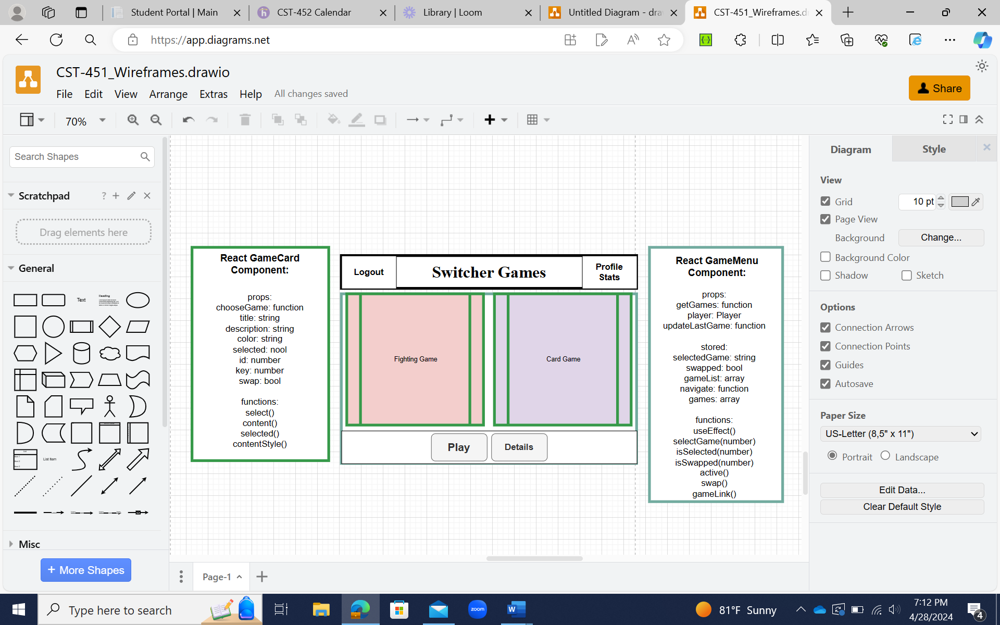

**Introduction**

As someone who loves to play video games, I have seen tons of different
types of games over the years. There are first-person shooters, card
games, match-3 games, role play games, board games, story games, and now
A.I. games. While having so many options is great players, there is an
underlying problem. People who enjoy playing one genre might now want to
play other genres that their friends are playing. This limits the
community of those who can play together. For example, grandmothers tend
to play different types of games than their grandsons and cannot bond
over those games. Another problem that arises from a plethora of games
is the loss of progress from switching games. If a player wants to reach
a high level in one game, they have to exclusively play that game to
make that progress. If they go play another game, they will be missing
out on what they could get by playing the first one. I attempted to fix
both these problems in my project know as Switcher Games.

Switcher Games is a project that takes simple games and puts a complex
spin on them. Its entire premise is based on having a list of games from
vastly different genres all using the exact same data. For instance, for
a stat such as “damage” every game must include that stat somewhere in
the game. If inside of one game the player gets an increase to the
“damage” stat, then when they switch over to another game, they still
have the increased stat. This unique feature allows players to progress
in all the games at once while only playing a single game that they
enjoy thus increasing the value and entertainment that can come from
playing video games. Since the games can cover a broad range of genres,
people who enjoy completely different game styles can play and progress
together no matter what they are playing.

**High-Level Requirement?**

At a high level, this project was divided into 12 features that needed
to be implemented to meet in-scope requirements.

-   Game menu featuring two playable games.

-   Data sharing across all games.

-   Games saving data after being played.

-   Statistics page showing profile specific information.

-   Fighting game menu to choose difficulty and enemy type for the
    fighting game.

-   Fighting game where players battle different monsters and try to
    defeat them.

-   Card matching game menu to choose difficulty for the matching game.

-   Card matching game where players try to match 2 cards with the same
    values until a certain score is reached.

-   Profile creation page where users can register a new profile.

-   Login Page where users can login to a profile they already have.

-   Navbar that allows users to navigate to different pages wherever
    they are on the website.

-   Nonfunctional requirement that allows users to run the website from
    older browser versions.

**Chosen Technologies**

Switcher Games utilized plenty of technologies in the tech stack.

-   SQLite3 for data storage.

-   TypeScript to help keep types straight in JavaScript.

-   React for designing the website.

-   Node.js to run the JavaScript/TypeScript code.

-   Pixi.js to create the game animations.

-   Webpack to handle my CSS and JavaScript/TypeScript compiling.

-   CSS modules for organizing my CSS files.

-   Babel for TypeScript and handling older JavaScript versions.

-   Express.js for handling the backend APIs.

-   Visual Studio Code for writing code as the IDE.

-   Midjourney A.I. for artwork.

The application was split between a front-end using JavaScript and Node,
and a back-end using JavaScript and Express. I decided to use
JavaScript/TypeScript as the language because it is the language I know
the least out of all the coding languages I have used. However, I also
chose JavaScript because it is a great language for building web
applications like Switcher Games. I chose SQLite as the database since
all the games on Switcher Games share the same database. Reusing the
same database across games saves a ton of storage space and SQLite is a
great way to store small databases. I chose Pixi.js to run the animation
because it has so many tools to create and manage sprites. It was a
great way to create animations from the images I have. I also got my
game images from Midjourney A.I.

Midjourney A.I. generated images of a flaming chestplate and a goblin.

My front-end application accesses the database on the back-end with
asynchronous API calls where my database is accessed through
parameterized queries to avoid SQL injection. The queries are serialized
and finalized to keep the statements executing in the proper order.

**New Technologies**

I learned a couple new technologies I have never used before in order to
build Switcher Games.

The first new technology I had to learn was SQLite. I wanted to learn
SQLite because it is a handy database that can store information easily
for smaller projects. Everything in SQLite is also supported in SQL
which made it very simple to create tables and run queries. The only
tricky part of working with SQLite was learning how to set up the
database file and run safe queries to it.

The other technology I had to learn was Pixi.js. I have always wanted to
learn how to make more advanced animations and Switcher Games was the
perfect project to learn that. Pixi has been a ton of fun to learn since
there is so much I can do with it. Learning Pixi.js was fun all of the
time however, I ran into several unforeseen issues with WebGL from not
cleaning up my Pixi stages properly. It took awhile to debug those
issues, but it was still worth it in the end to learn how to use Pixi.
Pixi.js is a fun and powerful technology that I am looking forward to
using in future projects.

**Technical Approach**

I tried to keep my code as loosely coupled as possible while creating
reusable code wherever I could. For example, I created each game to be
independent from every other game. The only thing the games have in
common is the same database. That way no matter how much code I change
in the matching game, the fighting game will never be changed unless I
change the API calls or database. I also have my code being reused for
each game. In fact, all I have to do to add a new game is add 1 line to
the database and the game will be added to the menu with its own color,
working description, working navbar link when that game is played,
updating to most recent game when played, and a working play button the
leads to a new location where I can make the game.

The left side is the component design for the reusable GameCard
component. The right side is the GameMenu component design. The middle
is where those components are located on the game menu wireframe.

I also designed my Pixi.js Sprites to be object oriented for
reusability. I created classes for my Pixi Sprites that allow me to
instantiate a bunch of new Sprites with unique attributes to be added to
the canvas. This allows me to create an entire board of cards in one
line of a for loop by reusing my class Sprite code for different cards.

UML diagram for the Pixi Card Sprite class with variables on top and
methods on the bottom. The right side of the picture shows where the
Sprites are used in the wireframe for the matching game.

**Risks and Challenges**

My initial risks that I had before starting Switcher Games were mostly
related to using technologies I had never used before. I started
managing these risks even before even starting to write any code by
working on proof of concepts (PoC) for the unfamiliar technologies.

The most prominent PoC I made was with Pixi.js. I went through a couple
Pixi tutorials then made an application all on my own to get a better
grasp of what I could do with Pixi.

The PoC included rocks of varying sizes falling at different speeds in
random locations. When a rock falls off the bottom of the screen, it
moves back to the top in a new random location. If the mouse cursor
touches one of the rocks, a message will appear in the middle of the
screen saying which rock number got hit. The message quickly grows but
when the message gets too large, it will disappear.

While the PoCs helped me learn the new technologies I still had a few
unforeseen issues when trying to create the application.

The biggest issue I ran into was trying to get the Pixi Sprite classes
to communicate with React when they performed an animation. I could get
my cards in the matching game to flip over, but I could not tell react
that it happened. I tried several different ways to fix this issue but
the one that ended up working was grabbing some code that came from one
of the tutorials I had used to learn Pixi. The code was called Tink, and
I used it to determine when the Pixi canvas was clicked and run the
flipping animation on the card at those coordinates on the canvas. Since
the Tink object was in react, it could also tell react that something
was clicked and what the card value was.

**Outstanding Issues**

The only outlying issue has to do with the nonfunction requirement for
allowing the website to work on older browser versions. This was
accomplished by using babel-preset-env which checks the version of the
user’s browser and converts the JavaScript code to an older version when
necessary. While the code is setup to handle older browser versions, I
have no way to test if all old browsers are working properly. Once the
application is deployed to the cloud, there are websites that can be
used to check if the project is working on older browsers. Until then,
there is no way to verify that the nonfunctional requirement was
actually met.

Aside from that one issue, there are currently no known issues or bugs
with the code!
